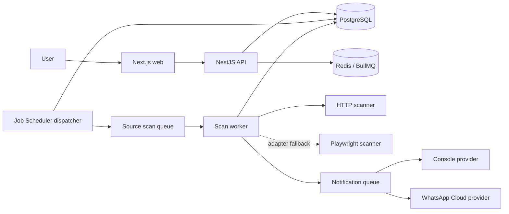

# Architecture

## Context

TicketWatch separates user intent from shared source monitoring. A source URL is canonicalized,
fingerprinted, and stored once; all matching watch rules attach to that source.



## Services and queues

The web process renders UI and contains no scraping code. The API owns request validation,
authentication, ownership policy, previews, and commands. The worker owns four queues:
`dispatcher`, `source-scan`, `notification`, and `retention`.

A single BullMQ Job Scheduler emits a dispatcher job. The dispatcher claims due monitors in a
short database transaction, advances `nextCheckAt` with bounded jitter, and enqueues one job per
source. Source scan jobs use a deterministic job ID and distributed source lock; database
constraints remain the final idempotency boundary.

## Scan lifecycle

```mermaid
sequenceDiagram
  participant D as Dispatcher
  participant DB as PostgreSQL
  participant Q as BullMQ
  participant S as Scan worker
  participant A as Adapter
  D->>DB: claim due source monitors
  D->>Q: enqueue scan(sourceId, correlationId)
  S->>S: acquire source lock
  S->>DB: verify source ACTIVE
  S->>A: HTTP-first extraction; browser fallback if permitted
  A-->>S: normalized listings
  S->>DB: transaction(scan, snapshot, listings, watch transitions, events, notifications)
  S->>Q: enqueue committed notification IDs
  S->>S: release source lock
```

Failures create typed failed scans and update scan health; they never manufacture an unavailable
result. Matching may be skipped for an unchanged content hash only when no relevant watch
configuration changed since the prior evaluation.

## Notification lifecycle

`AvailabilityOpened` creates a notification request with deterministic key
`watchRuleId:eventType:availabilityOccurrenceId`. A unique database constraint prevents retry or
race duplicates. Network I/O happens after the event transaction. Provider acceptance and
delivery are different states; delivery records retain provider events idempotently.

## Evolution

The modular monorepo supports separately scaled API, HTTP scan, browser scan, and notification
workers without splitting repositories. Domain events are internal typed messages; Kafka is not
required for this milestone.
