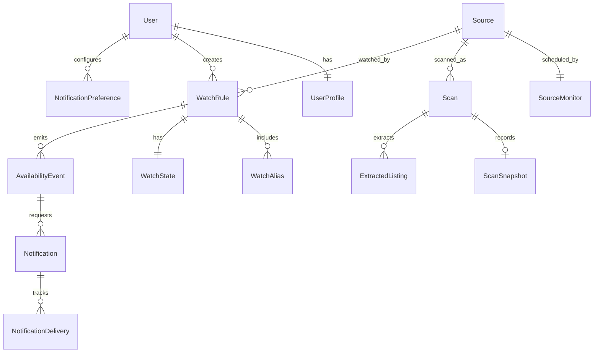

# Domain model

`Source` is a canonical public page and deduplication boundary. `SourceMonitor` contains shared
scheduling and health state. `WatchRule` expresses one user's matching intent and owns a
`WatchState`. A successful `Scan` owns a `ScanSnapshot` and relational `ExtractedListing`s.

Important invariants:

1. Canonical source fingerprints are unique.
2. One active scan per source is enforced by lock plus deterministic job/run keys.
3. Failed scans do not change availability to unavailable.
4. `SEARCHING -> AVAILABLE` creates one occurrence and one availability-open event.
5. Notification idempotency keys are unique even when jobs retry.
6. Every user command applies an ownership policy; IDs alone never authorize access.

Raw HTML is not a primary record. Normalized listings and a deterministic content fingerprint
are retained; bounded diagnostic snapshots have explicit expiry timestamps.
